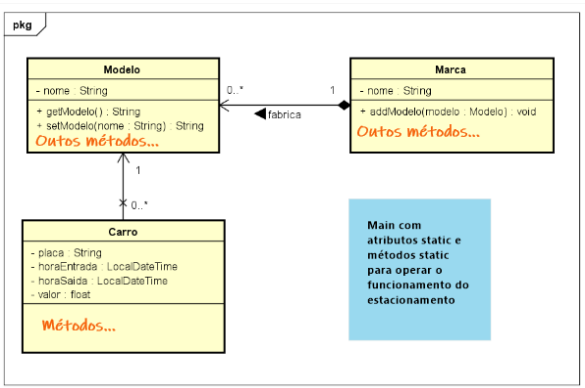

# Estacionamento
Projeto 1 de Programação Orientada a Objetos (POO) - Controle de Estacionamento  

# Contexto

O programa, desenvolvido deve permitir a realização de operações de entrada e saída de carros
de um estacionamento, bem como a consulta (através de relatório gerencial) da movimentação de um dia em
particular.    
O projeto, cujo esqueleto foi construído em sala já contém a base das classes Carro,
Marca e Modelo (modelo de domínio da aplicação) e a classe de execução Principal.
 

 
# Diagrama de classes (esqueleto)

# Sessão Típica
Uma sessão típica consiste em:
1. cadastrar a entrada do carro: o sistema mostra uma lista de marcas para escolher uma (AL marca) e depois uma
lista de modelos disponíveis para escolher (a partir do ArrayList modelo da classe Marca). Caso o modelo não exista
na lista, é possível escolher uma opção para cadastrar um novo modelo (o que pode incluir uma nova marca). Uma vez
escolhida a marca, o sistema pega a data e hora e inclui o carro no estacionamento (vetor vagas)  
2. Efetuar uma saída de carro: o usuário informa o número da vaga em uso (que corresponde a posição do vetor
vagas), o sistema registra data e hora de saída, calcula o preço e coloca este objeto no AL historico, a vaga fica livre
para ser usada novamente. A primeira hora custa R$ 10,00, que é o valor mínimo praticado. Após uma hora o valor é
fracionado, R$ 2,00 a cada 15 minutos.  
3. cadastrar marca: permite o cadastro de novas marcas de carro.  
4. cadastrar modelo: permite o cadastro de novos modelos de carros associados a uma marca já existente no sistema
(AL marca)  
5. mostrar relatório gerencial consolidado: solicita a data (dd/mm/aaaa) que se deseja consultar e mostra,
consultando o AL historico, todas as movimentações efetuadas naquele dia, cada linha contendo: placa, modelo,
marca, entrada, saída e valor pago. Ao final, mostrar também o valor total faturado naquele dia.  

# Requisitos
- A organização do menu, linear como sugerido acima, ou em níveis, bem como a sequência/nomenclatura ficam livres
para a equipe decidir, o importante é permitir que sejam possíveis as operações listadas, ou seja, a funcionalidade do
sistema.  
- O vetor vagas, contendo as 100 vagas numeradas do estacionamento, e os ArrayList marca e historico devem ser
usados na implementação de sua solução, bem como as três classes já estruturadas. Novos atributos podem ser
adicionados bem como os diversos métodos de instância e de classe devem ser implementados para atender ao
funcionamento esperado.  
- A estacionar um carro, a primeira vaga disponível no estacionamento (vetor vagas) deve ser utilizada (considerando
que carros entram e saem, deixando vagas livres).
O relatório gerencial deve ser mostrado em ordem de chegada (ascendente), do início ao final do dia da data
escolhida.  
- Para facilitar a apresentação prática do código funcionando, deixar alguns objetos cadastrados prontos nas listas, com
criação dos objetos harcoded, logo no início da main.

# Entregue 
- 15/05/2021 
- Erick Lemmy dos Santos Oliveira
